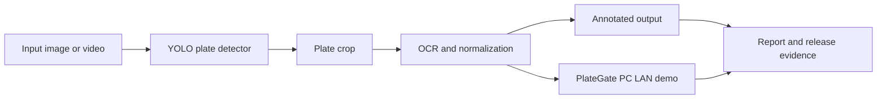

# Vietnamese Automatic License Plate Recognition with YOLO and OCR

<p align="center">
  
</p>

<p align="center">
  <a href="https://github.com/lhlizdabezt/NhapMonAI/releases/latest"></a>
  <a href="https://github.com/lhlizdabezt/NhapMonAI/tags"></a>
  
  
</p>

<p align="center">
  
</p>

<p align="center">
  
</p>

## Executive Summary

`NhapMonAI` is an academic computer vision portfolio project for Vietnamese automatic license plate recognition. The repository combines YOLO/PyTorch plate detection, OCR/FastALPR recognition, Kaggle/IPYNB training evidence, a Python desktop inference application, a LAN-based PlateGate PC demo, Typst report sources, seminar materials, visual assets and release snapshots.

The project is written for two audiences. HR reviewers can scan the repository quickly through the release, visuals, metrics and contact links. Engineering reviewers can trace the claims back to notebooks, source folders, checkpoints, screenshots, reports, release assets and bounded prototype notes.

## Five-Minute Review Path

| Step | What to Open | Why It Matters |
|---|---|---|
| 1 | Visuals at the top of this README | Shows the project scope without requiring a full source review |
| 2 | [Release page](https://github.com/lhlizdabezt/NhapMonAI/releases/latest) | Provides a stable package of report files, demo assets and source snapshots |
| 3 | [Quantitative Results](#quantitative-results) | Grounds the YOLO claim in validation-set metrics |
| 4 | [Evidence Gallery](#evidence-gallery) | Shows the desktop app, video inference output, confusion matrix and gate-demo evidence |
| 5 | [How to Run](#how-to-run) | Gives a practical path for running the Python app and LAN demo |

## Project Profile

| Field | Details |
|---|---|
| Repository | [lhlizdabezt/NhapMonAI](https://github.com/lhlizdabezt/NhapMonAI) |
| Portfolio category | Computer vision, machine learning, OCR and Python desktop tooling |
| Academic context | Introduction to Artificial Intelligence course project, Group 05, Faculty of Electronics and Telecommunications |
| Maintainer profile | [Luong Hai Long](https://github.com/lhlizdabezt) |
| Student ID | `22207056` |
| School | VNUHCM - University of Science |
| Primary stack | Python, PyTorch, Ultralytics YOLO, OpenCV, FastALPR, fast-plate-ocr, FFmpeg, Tkinter, Kaggle, IPYNB, Typst, Git LFS |
| Latest release | [GitHub Releases](https://github.com/lhlizdabezt/NhapMonAI/releases/latest) |
| Tags | [Version tags](https://github.com/lhlizdabezt/NhapMonAI/tags) |

## Evidence Highlights

| Evidence | Repository Material |
|---|---|
| Plate detector | YOLO/Ultralytics checkpoint and training outputs |
| OCR path | FastALPR / fast-plate-ocr references, plate-crop normalization and Python post-processing |
| Training trace | Kaggle notebook, local IPYNB files and checkpoint-continuation evidence |
| Desktop demo | Python Tkinter/OpenCV/FFmpeg app for image and video inference |
| Gate-control demo | PlateGate PC prototype with `/health` and `/scan` endpoints on port `8765` |
| Documentation | Typst report sources, seminar PDF, PPTX slide deck, screenshots and release notes |
| Portfolio packaging | English README, self-hosted visuals, GitHub release, tags, topics and Git LFS rules |

## Role and Scope

| Item | Honest Scope |
|---|---|
| Team context | Academic team project with seven members |
| Luong Hai Long's portfolio work | Maintained the public repository, normalized the README, release, tags, topics and visual evidence for review |
| Luong Hai Long's development work | Co-developed the Python desktop app and PlateGate PC demo within the team context |
| Prototype boundary | Academic dataset and LAN demo environment; not a production traffic-enforcement system |
| Review value | Evidence for applied computer vision, Python tooling, technical documentation, release packaging and engineering communication |

## System Overview



| Stage | Description |
|---|---|
| Input | User provides image or video data for plate detection |
| Detection | YOLO model detects plate regions and returns bounding boxes |
| Crop | Detected plate regions are extracted for downstream recognition |
| OCR | FastALPR / fast-plate-ocr workflow reads and normalizes candidate text |
| Output | The app renders annotated media and saves reviewable output files |
| Gate demo | LAN prototype accepts recognized plate strings for allow-list checking |

## Quantitative Results

The final reported detector checkpoint from the continuation-training stage has the following validation-set metrics:

| Metric | Validation Result |
|---|---:|
| Precision | `0.99448` |
| Recall | `0.99373` |
| mAP50 | `0.99450` |
| mAP50-95 | `0.77006` |

These metrics describe the detector on the project validation set. They should not be read as a production guarantee for OCR accuracy, uncontrolled lighting, difficult camera angles, occluded plates or traffic-enforcement deployment.

## Evidence Gallery

| Python Desktop App | YOLO and OCR Video Output |
|---|---|
|  |  |

| Confusion Matrix | Gate Demo Evidence |
|---|---|
|  |  |

## Repository Structure

```text
NhapMonAI/
|-- Academic_Deliverables/             # Seminar slide deck and assignment evidence
|-- AppPythonPlateGatePC/              # LAN PlateGate PC demo package
|-- AppPythonYOLO_OCR/                 # Python YOLO/OCR app, outputs, FFmpeg and checkpoints
|-- assets/                            # Self-hosted README visuals
|-- Group5_BaoCaoNhapMonAI/            # Typst report source, figures and bibliography
|-- Group5_Notebook_IPYNB/             # First-training and continuation-training notebooks
|-- HinhAnhBaoCao/                     # Report and slide screenshots
|-- Group5_BaoCaoSeminarNhapMonAI.pdf  # Final seminar report
|-- RELEASE_NOTES.md                   # Release summary for the current portfolio snapshot
|-- v65.pt                             # Main YOLO checkpoint
`-- README.md
```

## How to Run

Install Git LFS before cloning because the repository contains model checkpoints, app bundles and larger media assets.

```bash
git lfs install
git clone https://github.com/lhlizdabezt/NhapMonAI.git
cd NhapMonAI
git lfs pull
```

Run the Python desktop app for image or video inference:

```bash
cd AppPythonYOLO_OCR
python -m pip install --upgrade pip
python -m pip install -r requirements.txt
python Group5_AppPython_YOLO_OCR.py
```

Run the Windows batch launcher:

```bash
cd AppPythonYOLO_OCR
run_Group5_AppPython_YOLO_OCR.bat
```

Run the PlateGate PC LAN demo:

```bash
cd AppPythonPlateGatePC/PlateGatePC
python Group5_AppPYMoRongThucTe.py
```

Check the demo endpoints after the PlateGate PC app is running:

```powershell
Invoke-RestMethod -Uri "http://127.0.0.1:8765/health"
Invoke-RestMethod -Uri "http://127.0.0.1:8765/scan" -Method Post -ContentType "application/json" -Body '{"plate":"59A22256","score":0.99,"source":"manual-test"}'
```

| Endpoint | Purpose |
|---|---|
| `GET /health` | Confirms that the local demo server is running |
| `POST /scan` | Sends a recognized plate string to the demo workflow |
| Port `8765` | Default local LAN demo port |
| `bien_so_duoc_phep.txt` | Allow-list file used by the PC gate demo |

## Notebook, Dataset and References

| Source | Role | Notes |
|---|---|---|
| [Group 5 Kaggle notebook](https://www.kaggle.com/code/luonghailong/group-5-vietnamese-license-plates-detection-lhl) | Training and experiment trace | Paths may need adjustment outside the Kaggle environment |
| [Dataset folder on Google Drive](https://drive.google.com/drive/folders/1xBDnh_NdHC5JePgazb0ZRDhu6Jpbo3sT?usp=drive_link) | Dataset storage used by the group | Access depends on the Drive sharing configuration |
| [FastALPR](https://github.com/ankandrew/fast-alpr) | ALPR framework reference | Useful for comparing OCR and inference organization |
| [fast-plate-ocr](https://github.com/ankandrew/fast-plate-ocr) | OCR-related reference | Useful when comparing or replacing OCR components |

| Notebook in This Repository | Purpose |
|---|---|
| `Group5_Notebook_IPYNB/Group5_Notebook01_FirstTraining.ipynb` | First YOLO training run from scratch |
| `Group5_Notebook_IPYNB/Group5_Notebook02_ContinuationTraining.ipynb` | Continuation training from checkpoint |
| `AppPythonYOLO_OCR/group-5-vietnamese-license-plates-detection-lhl.ipynb` | Kaggle-style notebook with runnable traces and outputs |

## GitHub Metadata

| Metadata Item | Current Intent |
|---|---|
| Repository description | Vietnamese ALPR portfolio project using YOLO/PyTorch and OCR/FastALPR, with Kaggle/IPYNB training evidence, desktop inference, LAN demo, reports and release-backed visuals |
| Topics | `alpr`, `license-plate-recognition`, `vietnamese-license-plate`, `yolo`, `ocr`, `computer-vision`, `machine-learning`, `pytorch`, `opencv`, `kaggle`, `fast-alpr`, `object-detection`, `python`, `jupyter-notebook`, `git-lfs`, `tkinter`, `ffmpeg`, `typst`, `academic-project`, `hcmus` |
| Release | [Latest release](https://github.com/lhlizdabezt/NhapMonAI/releases/latest) |
| Tags | [Tag list](https://github.com/lhlizdabezt/NhapMonAI/tags) |
| Main languages | Python, Jupyter Notebook, Typst |
| Large assets | Managed with Git LFS where appropriate |

## Release Assets

| Asset | Review Use |
|---|---|
| [Seminar report PDF](https://github.com/lhlizdabezt/NhapMonAI/releases/latest/download/Group5_BaoCaoSeminarNhapMonAI.pdf) | Read the project objective, method, results and limitations |
| [Seminar slide deck](https://github.com/lhlizdabezt/NhapMonAI/releases/latest/download/Group5_SlideSeminarNhapMonAI.pptx) | Review the class presentation artifact |
| [Python YOLO/OCR app archive](https://github.com/lhlizdabezt/NhapMonAI/releases/latest/download/AppPythonYOLO_OCR.7z) | Run or inspect the desktop inference application |
| [PlateGate PC archive](https://github.com/lhlizdabezt/NhapMonAI/releases/latest/download/AppPythonPlateGatePC.zip) | Inspect the LAN gate-control prototype |
| [Line-free motion GIF](https://github.com/lhlizdabezt/NhapMonAI/releases/latest/download/alpr-pipeline-motion.gif) | Visual reviewer aid with English labels and no animated connector lines |
| [English SVG review card](https://github.com/lhlizdabezt/NhapMonAI/releases/latest/download/alpr-review-card.svg) | ASCII-safe visual summary for profile embeds and release evidence |
| [Line-free portfolio SVG](https://github.com/lhlizdabezt/NhapMonAI/releases/latest/download/portfolio-motion.svg) | English profile visual with no moving dotted or curved lines |
| Source snapshot | Versioned repository snapshot tied to the release tag |

## Frequently Asked Questions

| Question | Answer |
|---|---|
| Is this a production traffic-enforcement product? | No. It is an academic prototype and portfolio archive with validation-set detector metrics and LAN demo evidence. |
| What is the strongest engineering signal? | The project connects model training, OCR workflow, desktop inference, LAN demo behavior, documentation and release packaging. |
| Where should reviewers start? | Start with the release page, this README, the quantitative results table and the visual evidence gallery. |
| Why are releases and tags important here? | They preserve stable review snapshots for HR, faculty review and engineering inspection. |
| Does the README use English only? | Yes. The public-facing README text, table labels, captions and SVG-visible text are written in US English. |
| Why are the visuals line-free? | The current visual pass avoids animated connector lines, dotted paths and curved lines so text remains unobstructed in GitHub rendering. |

## Team

| Student ID | Name | Portfolio Note |
|---|---|---|
| `22207043` | Mai Xuan Khang | Group 05 member |
| `22207106` | Truong Quang Vu | Group 05 member |
| `22207112` | Ly Phi Hung | Group 05 member |
| `22207063` | Van Dinh Nam | Group 05 member |
| `22207062` | Tran Si Nam | Group 05 member |
| `22207056` | [Luong Hai Long](https://github.com/lhlizdabezt) | Repository maintenance, release packaging, Kaggle evidence, Python app contribution and portfolio documentation |
| `22207066` | Le Tan Phi Pha | Group 05 member |

## Maintainer Contact

| Channel | Link |
|---|---|
| GitHub | [github.com/lhlizdabezt](https://github.com/lhlizdabezt) |
| LinkedIn | [linkedin.com/in/lhlizdabezt](https://www.linkedin.com/in/lhlizdabezt) |
| Work email | [luonghailong.work@gmail.com](mailto:luonghailong.work@gmail.com) |
| Student email | [22207056@student.hcmus.edu.vn](mailto:22207056@student.hcmus.edu.vn) |
| Phone | [+84 988 114 708](tel:+84988114708) |
| Facebook | [facebook.com/wageseadrake](https://www.facebook.com/wageseadrake) |
| Instagram | [instagram.com/lhlizdabezt](https://www.instagram.com/lhlizdabezt) |
| YouTube | [youtube.com/@lhlizdabezt](https://www.youtube.com/@lhlizdabezt) |
| TikTok | [tiktok.com/@wageseadrake](https://www.tiktok.com/@wageseadrake) |

## Transparency Notes

- The repository is an academic project archive and should be reviewed as evidence of technical workflow, not as a production deployment.
- Dataset paths and Google Drive access can require permission or path changes outside the original environment.
- OCR behavior depends on image quality, camera angle, lighting, occlusion, plate layout and post-processing rules.
- The repository does not currently include a formal open-source license, so treat it as a public academic portfolio archive until a license is added.

## Writing Standard

This README uses an evidence-first Harvard/IEEE-style professional standard: direct technical nouns, bounded claims, reproducible links, release-backed assets and clear distinction between coursework, prototype behavior and production deployment.
