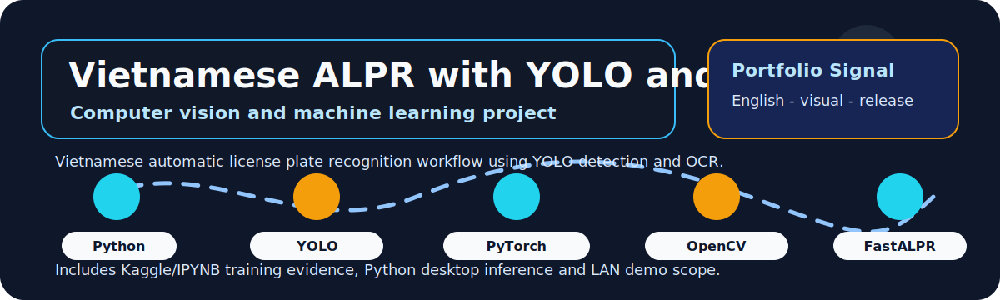

# Vietnamese Automatic License Plate Recognition with YOLO and OCR

  
  
  

  

## Overview

This repository presents a Vietnamese automatic license plate recognition workflow that combines YOLO/PyTorch detection, OCR/FastALPR recognition, Kaggle/IPYNB training evidence, a Python desktop application and a LAN-based PlateGate PC demo.

| Field | Details |
|---|---|
| Repository | [NhapMonAI](https://github.com/lhlizdabezt/NhapMonAI) |
| Portfolio category | Computer vision / machine learning course project |
| Primary stack | Python, PyTorch, Ultralytics YOLO, OpenCV, FastALPR, fast-plate-ocr, FFmpeg, Tkinter, Kaggle, IPYNB, Typst, Git LFS. |
| Latest release | [GitHub Releases](https://github.com/lhlizdabezt/NhapMonAI/releases/latest) |
| Tags | [Version tags](https://github.com/lhlizdabezt/NhapMonAI/tags) |
| Owner profile | [Luong Hai Long](https://github.com/lhlizdabezt) |

## Reviewer Map

| What to Review | Where to Look | Why It Matters |
|---|---|---|
| Technical scope | This README and source tree | Gives a quick, bounded reading path before opening every file |
| Evidence assets | Release page and top-level project files | Shows what can be downloaded or inspected quickly |
| Implementation material | Source folders, scripts, notebooks or design files | Connects the portfolio claim to real project artifacts |
| Version history | Tags and release notes | Makes the repository easier to audit over time |

## Evidence Highlights

- YOLO detector with reported mAP50 0.99450 on the project validation set.
- OCR pipeline using FastALPR / fast-plate-ocr concepts with plate-crop normalization.
- Python desktop app for image/video inference and a PlateGate PC LAN prototype with health and scan endpoints.
- Typst report, seminar slides, motion GIF, reviewer card, Git LFS-managed assets and release packages.

## Repository Structure

| Path | Purpose |
|---|---|
| `Academic_Deliverables/` | Top-level directory included in the repository |
| `AppPythonPlateGatePC/` | Top-level directory included in the repository |
| `AppPythonYOLO_OCR/` | Top-level directory included in the repository |
| `assets/` | Top-level directory included in the repository |
| `Group5_BaoCaoNhapMonAI/` | Top-level directory included in the repository |
| `Group5_Notebook_IPYNB/` | Top-level directory included in the repository |
| `HinhAnhBaoCao/` | Top-level directory included in the repository |
| `Group5_BaoCaoSeminarNhapMonAI.pdf` | Top-level file included in the repository |

## Scope and Boundaries

Academic team project and portfolio archive. The detector metrics are tied to the project validation set; the OCR and gate-control components are prototypes, not production traffic-enforcement systems.

## Role and Portfolio Context

Luong Hai Long maintained the public repository and release packaging, and co-developed the Python desktop and PlateGate PC demo within the team context.

## Release and Tagging Notes

This repository is maintained as part of an English-facing engineering portfolio. Releases and tags are used to preserve reviewable snapshots of the project, including source state, documentation updates and any available visual or report assets.

## Writing Standard

The README follows an evidence-first style: direct technical nouns, clear project boundaries, release-backed artifacts and no inflated claims beyond what the repository can support.
