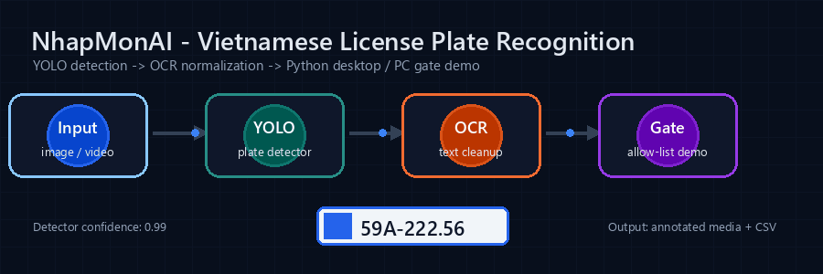
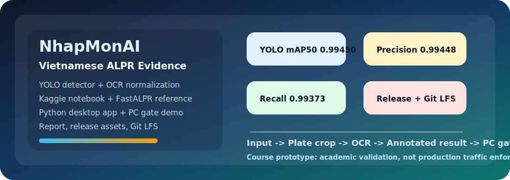
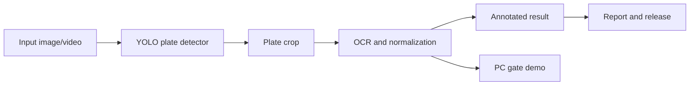
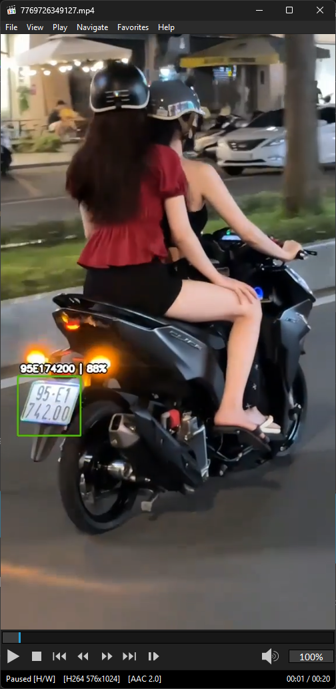
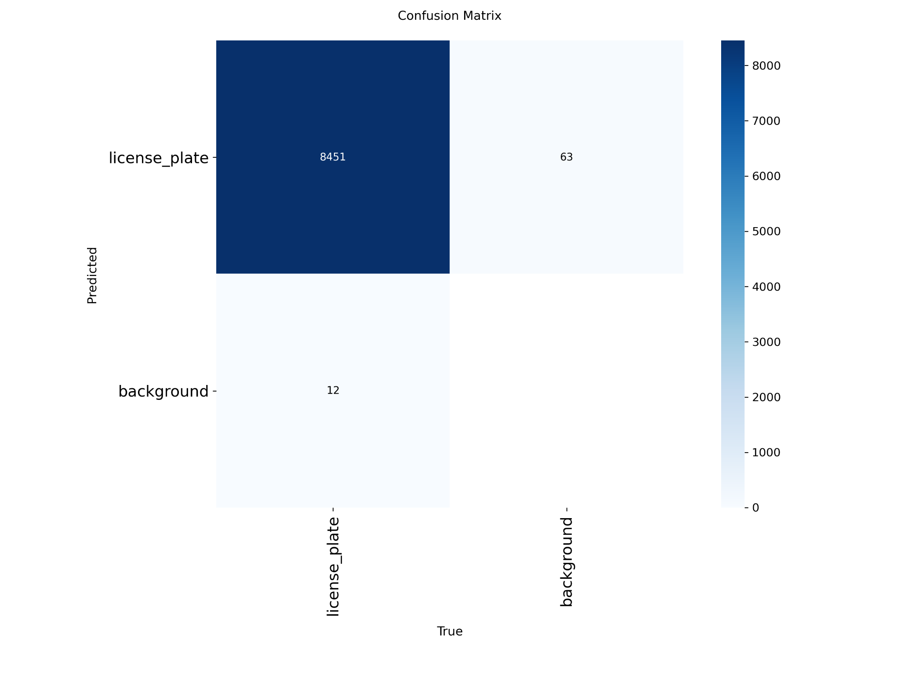
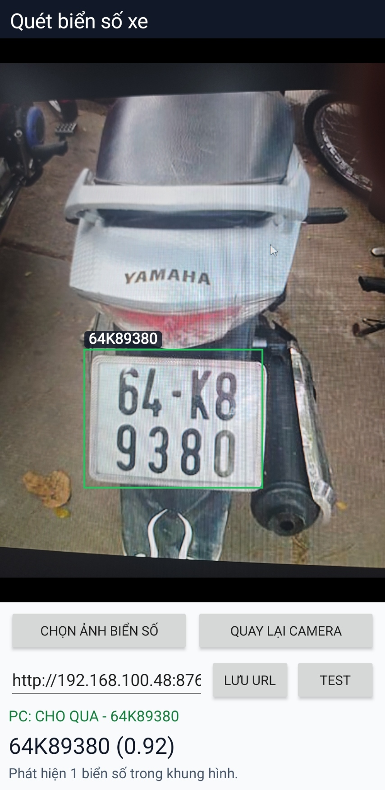

# NhapMonAI - Nhận diện biển số xe Việt Nam bằng YOLO và OCR

<p align="center">
  
</p>

<p align="center">
  <a href="https://github.com/lhlizdabezt/NhapMonAI/releases/latest">
    
  </a>
  <a href="https://github.com/lhlizdabezt/NhapMonAI/tags">
    
  </a>
  
  
  
</p>

<p align="center">
  <b>Đồ án Nhập môn Trí tuệ Nhân tạo: phát hiện, cắt vùng biển số, nhận dạng ký tự và đóng gói demo kỹ thuật có thể đánh giá nhanh.</b><br />
  <sub>Nhóm 05 - Khoa Điện tử Viễn thông - Trường Đại học Khoa học Tự nhiên, ĐHQG-HCM</sub>
</p>

<p align="center">
  
</p>

---

## 🚦 Điểm vào đánh giá nhanh

| Hạng mục | Liên kết | Giá trị khi đánh giá |
| --- | --- | --- |
| Repo chính | [lhlizdabezt/NhapMonAI](https://github.com/lhlizdabezt/NhapMonAI) | Toàn bộ mã nguồn, notebook, báo cáo, app Python, demo cổng PC và tài sản minh chứng |
| Bản phát hành | [Bản phát hành mới nhất](https://github.com/lhlizdabezt/NhapMonAI/releases/latest) | Ảnh chụp phiên bản ổn định để HR, giảng viên hoặc kỹ sư tải nhanh thay vì lần mò trong cây thư mục |
| Thẻ Git | [Danh sách tags](https://github.com/lhlizdabezt/NhapMonAI/tags) | Mốc phiên bản rõ ràng cho bản nộp và các lần nâng cấp README/portfolio |
| Notebook Kaggle | [Group 5 - Vietnamese License Plates Detection LHL](https://www.kaggle.com/code/luonghailong/group-5-vietnamese-license-plates-detection-lhl) | Dấu vết thí nghiệm, huấn luyện và chạy thử theo môi trường Kaggle |
| Bộ dữ liệu Google Drive | [VietnameseLicensePlatesDetectionDataset](https://drive.google.com/drive/folders/1xBDnh_NdHC5JePgazb0ZRDhu6Jpbo3sT?usp=drive_link) | Nguồn dữ liệu nhóm dùng để tổ chức huấn luyện, kiểm thử và minh họa |
| FastALPR tham khảo | [ankandrew/fast-alpr](https://github.com/ankandrew/fast-alpr) | Bộ khung ALPR hiệu năng cao để tham chiếu luồng OCR, mô hình ONNX và cách tổ chức giao diện lập trình |
| Hồ sơ cá nhân | [Lương Hải Long trên GitHub](https://github.com/lhlizdabezt) | Bối cảnh năng lực: Điện tử Viễn thông, Python, AI/OCR, FPGA/SoC, C/C++, MATLAB, IPYNB |

---

## 🎯 Hồ sơ đánh giá

| Góc đánh giá | Nội dung |
| --- | --- |
| Loại dự án | Đồ án học phần Nhập môn Trí tuệ Nhân tạo, Nhóm 05, HCMUS FETEL |
| Điểm mạnh kỹ thuật | Có đủ notebook, checkpoint, app desktop, demo cổng PC, báo cáo Typst, hình kết quả, release và metadata GitHub |
| Vai trò portfolio của Lương Hải Long | Duy trì repo public, chuẩn hóa README/release/tags/topics, liên kết Kaggle/dataset/FastALPR và đóng gói minh chứng để reviewer kiểm tra nhanh |
| Phạm vi trung thực | Nguyên mẫu học thuật trên dữ liệu và môi trường nhóm đã dùng; chưa tự nhận là hệ thống giao thông sản xuất |

---

## 🧭 Tóm tắt dự án

`NhapMonAI` là đồ án ứng dụng AI theo hướng khép kín cho bài toán nhận diện biển số xe Việt Nam. Repo không chỉ lưu notebook huấn luyện mà còn đóng gói ứng dụng máy tính, demo cổng PC, ảnh minh chứng, báo cáo Typst, slide, điểm lưu mô hình và bản phát hành để người đánh giá có thể nhìn thấy cả quá trình kỹ thuật lẫn kết quả cuối.

| Góc nhìn | Nội dung chính |
| --- | --- |
| Bài toán | Phát hiện biển số trong ảnh hoặc video, cắt vùng biển số, chạy OCR, chuẩn hóa chuỗi ký tự và xuất kết quả trực quan |
| Mô hình | YOLO/Ultralytics cho phát hiện vùng biển số, OCR qua FastALPR/fast-plate-ocr và các bước hậu xử lý bằng Python |
| Ứng dụng | App Python desktop cho ảnh/video và demo cổng PC nhận biển số qua mạng LAN |
| Tài liệu | Báo cáo Typst, PDF seminar, slide, hình ảnh kết quả, notebook IPYNB và file hướng dẫn chạy |
| Tín hiệu portfolio | Có mô tả repo, chủ đề, bản phát hành, tag, Git LFS, minh chứng hình ảnh và đường dẫn dữ liệu rõ ràng |



---

## 📊 Kết quả định lượng

Điểm lưu mô hình sau giai đoạn huấn luyện tiếp tục được báo cáo trong tài liệu cuối đạt:

| Chỉ số | Kết quả kiểm định |
| --- | ---: |
| Precision | `0.99448` |
| Recall | `0.99373` |
| mAP50 | `0.99450` |
| mAP50-95 | `0.77006` |

Kết quả này cho thấy bộ phát hiện hoạt động tốt trên tập kiểm định của đồ án. Phần OCR và triển khai thực tế vẫn được ghi rõ là minh chứng nguyên mẫu học thuật, không tự nhận là hệ thống kiểm soát giao thông sản xuất.

---

## 🖼️ Bằng chứng hình ảnh

| App Python desktop | Pipeline video YOLO + OCR |
| --- | --- |
|  |  |

| Ma trận nhầm lẫn | Demo Android hoặc cổng PC |
| --- | --- |
|  |  |

---

## 🗂️ Cấu trúc repo

```text
NhapMonAI/
|-- AppPythonYOLO_OCR/                 # App Python YOLO + OCR, đầu ra demo, FFmpeg và checkpoint
|-- AppPythonPlateGatePC/              # Demo cổng PC nhận biển số qua HTTP/LAN
|-- Group5_Notebook_IPYNB/             # Notebook huấn luyện lần đầu và huấn luyện tiếp tục
|-- Group5_BaoCaoNhapMonAI/            # Source Typst, hình ảnh, thư mục assets và bibliography
|-- HinhAnhBaoCao/                     # Ảnh minh chứng dùng cho báo cáo và slide
|-- Academic_Deliverables/             # Slide seminar và bảng phân công công việc
|-- assets/                            # GIF và visual cho README
|-- Group5_BaoCaoSeminarNhapMonAI.pdf  # Báo cáo seminar cuối
|-- v65.pt                             # Checkpoint YOLO chính
`-- README.md
```

---

## ⚙️ Cách chạy nhanh

Cài Git LFS trước khi clone vì repo có checkpoint, app bundle và tài sản dung lượng lớn:

```bash
git lfs install
git clone https://github.com/lhlizdabezt/NhapMonAI.git
cd NhapMonAI
git lfs pull
```

Chạy app Python nhận diện ảnh hoặc video:

```bash
cd AppPythonYOLO_OCR
python -m pip install --upgrade pip
python -m pip install -r requirements.txt
python Group5_AppPython_YOLO_OCR.py
```

Chạy bằng file `.bat` trên Windows:

```bash
cd AppPythonYOLO_OCR
run_Group5_AppPython_YOLO_OCR.bat
```

Chạy demo cổng PC:

```bash
cd AppPythonPlateGatePC/PlateGatePC
python Group5_AppPYMoRongThucTe.py
```

| Đầu cuối | Mục đích |
| --- | --- |
| `GET /health` | Kiểm tra server demo còn hoạt động |
| `POST /scan` | Gửi chuỗi biển số đã nhận dạng |
| Cổng `8765` | Cổng demo LAN mặc định |
| `bien_so_duoc_phep.txt` | Danh sách biển số được phép mở cổng |

---

## 📓 Notebook, dataset và nguồn tham khảo

| Nguồn | Vai trò | Ghi chú |
| --- | --- | --- |
| [Notebook Kaggle của nhóm](https://www.kaggle.com/code/luonghailong/group-5-vietnamese-license-plates-detection-lhl) | Chạy thí nghiệm, huấn luyện và lưu dấu vết theo môi trường Kaggle | Khi chạy ngoài Kaggle cần sửa lại đường dẫn bộ dữ liệu, checkpoint và đầu ra |
| [Bộ dữ liệu Google Drive](https://drive.google.com/drive/folders/1xBDnh_NdHC5JePgazb0ZRDhu6Jpbo3sT?usp=drive_link) | Lưu nguồn dữ liệu biển số xe Việt Nam phục vụ huấn luyện và kiểm thử | Quyền truy cập phụ thuộc cấu hình chia sẻ của thư mục Drive |
| [FastALPR](https://github.com/ankandrew/fast-alpr) | Bộ khung ALPR tham khảo cho OCR và pipeline nhận dạng biển số | Dùng để đối chiếu cách tổ chức mô hình, phần xử lý OCR và suy luận |
| [fast-plate-ocr](https://github.com/ankandrew/fast-plate-ocr) | Phần xử lý OCR liên quan trong hệ sinh thái ALPR | Hữu ích khi cần so sánh hoặc thay thế module OCR |

| Notebook trong repo | Mục đích |
| --- | --- |
| `Group5_Notebook_IPYNB/Group5_Notebook01_FirstTraining.ipynb` | Huấn luyện YOLO lần đầu từ đầu |
| `Group5_Notebook_IPYNB/Group5_Notebook02_ContinuationTraining.ipynb` | Huấn luyện tiếp tục từ checkpoint |
| `AppPythonYOLO_OCR/group-5-vietnamese-license-plates-detection-lhl.ipynb` | Notebook dạng Kaggle kèm dấu vết chạy thử và đầu ra |

---

## 🏷️ Siêu dữ liệu GitHub

| Hạng mục | Trạng thái |
| --- | --- |
| Mô tả repo | Dự án nhận diện biển số xe Việt Nam bằng YOLO, chuẩn hóa OCR, FastALPR, notebook Kaggle, bộ dữ liệu Google Drive, app Python và báo cáo Typst |
| Chủ đề chính | `alpr`, `license-plate-recognition`, `vietnamese-license-plate`, `yolo`, `ocr`, `computer-vision`, `kaggle`, `fast-alpr`, `object-detection`, `git-lfs` |
| Bản phát hành | [Bản phát hành mới nhất](https://github.com/lhlizdabezt/NhapMonAI/releases/latest) |
| Tags | [Danh sách tag](https://github.com/lhlizdabezt/NhapMonAI/tags) |
| Ngôn ngữ chính | Jupyter Notebook, Python, Typst |
| Tài sản lớn | Quản lý bằng Git LFS khi phù hợp |

---

## 👥 Nhóm thực hiện

| MSSV | Họ tên | Ghi chú portfolio |
| --- | --- | --- |
| `22207043` | Mai Xuân Khang | Thành viên Nhóm 05 |
| `22207106` | Trương Quang Vũ | Thành viên Nhóm 05 |
| `22207112` | Lý Phi Hùng | Thành viên Nhóm 05 |
| `22207063` | Văn Đình Nam | Thành viên Nhóm 05 |
| `22207062` | Trần Sĩ Nam | Thành viên Nhóm 05 |
| `22207056` | [Lương Hải Long](https://github.com/lhlizdabezt) | GitHub portfolio, Kaggle notebook, app Python, README, bản phát hành, tags/topics và đóng gói minh chứng |
| `22207066` | Lê Tấn Phi Pha | Thành viên Nhóm 05 |

---

## 🧰 Stack kỹ thuật

<p align="center">
  
</p>

| Nhóm công cụ | Công nghệ |
| --- | --- |
| Huấn luyện và suy luận | Python, Jupyter Notebook, Kaggle, YOLO/Ultralytics, OpenCV, NumPy, Pandas |
| OCR và hậu xử lý | FastALPR, fast-plate-ocr, chuẩn hóa chuỗi biển số, crop ảnh |
| App demo | Tkinter, Pillow, FFmpeg/FFprobe/FFplay, HTTP demo server |
| Tài liệu | Typst, PDF seminar, slide, hình ảnh minh chứng |
| Đóng gói | Git, GitHub CLI, Git LFS, release, tag, topics |

---

## 📦 Bản phát hành

Bản phát hành của repo được dùng như cửa vào ổn định cho người đánh giá:

| Tài sản | Vai trò |
| --- | --- |
| Báo cáo seminar PDF | Đọc nhanh mục tiêu, phương pháp, kết quả và giới hạn |
| Slide seminar | Trình bày ngắn gọn cho lớp hoặc buổi đánh giá |
| Mã nguồn/app Python OCR | Chạy demo nhận diện ảnh hoặc video |
| Mã nguồn/app demo cổng PC | Minh họa hướng tích hợp nhận diện biển số vào quy trình kiểm soát cổng |
| Notebook và checkpoint | Lưu dấu vết huấn luyện, kết quả và ảnh chụp trạng thái mô hình |

---

## 📌 Ghi chú minh bạch

- Repo là đồ án học thuật nên ưu tiên tính minh chứng, khả năng đánh giá và khả năng tái hiện theo môi trường nhóm đã dùng.
- Bộ dữ liệu và đường dẫn Kaggle/Drive có thể cần quyền truy cập hoặc chỉnh lại đường dẫn khi chạy trên máy khác.
- OCR trong thực tế phụ thuộc chất lượng ảnh, góc chụp, ánh sáng, biển số bị che khuất và quy tắc hậu xử lý.
- Chưa có giấy phép mã nguồn mở chính thức trong repo, vì vậy hãy xem đây là archive portfolio học thuật cho đến khi license được bổ sung.

---

<p align="center">
  <b>Nhóm 05 - Nhập môn Trí tuệ Nhân tạo - HCMUS FETEL</b><br />
  <sub>Từ notebook huấn luyện đến app demo, từ báo cáo học thuật đến repo có bản phát hành, tag và siêu dữ liệu để đánh giá.</sub>
</p>
