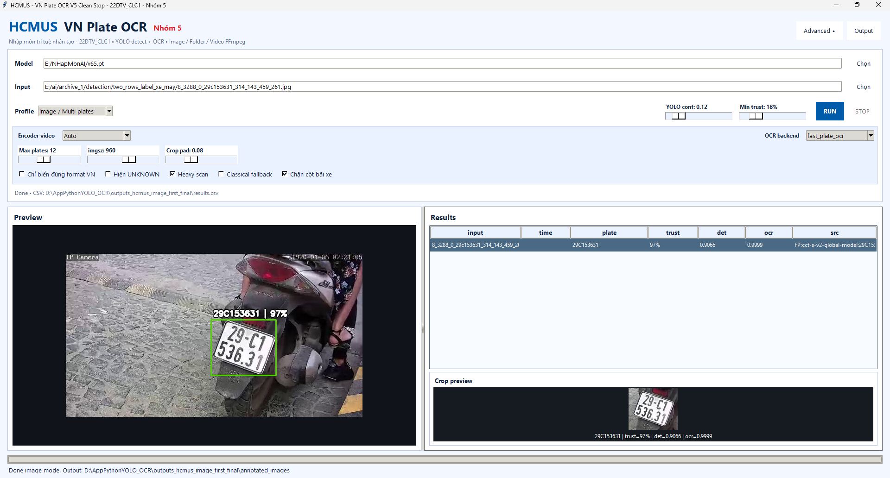
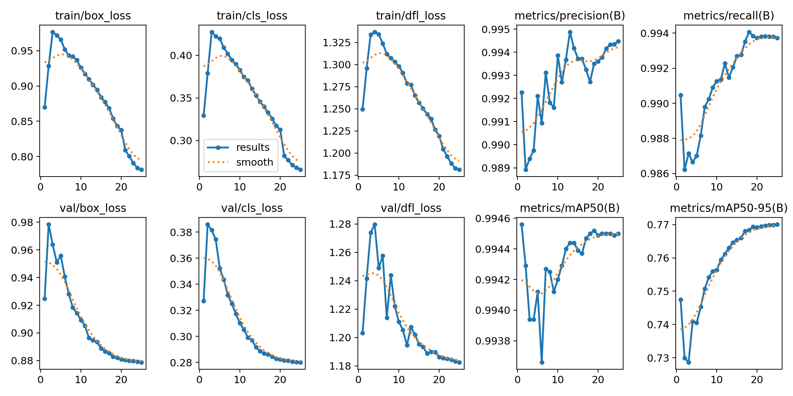
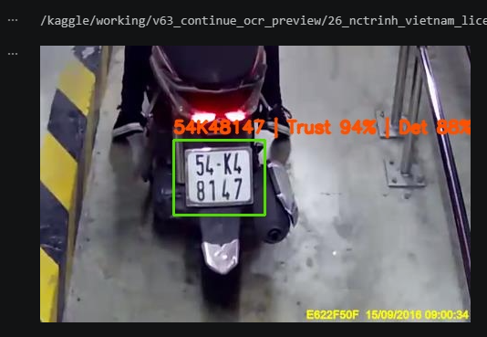
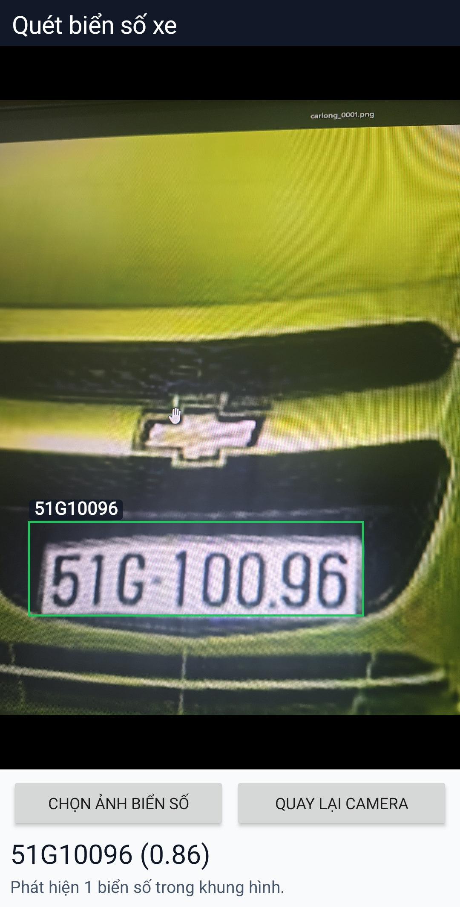

# NhapMonAI

Đồ án Nhập môn Trí tuệ Nhân tạo của Nhóm 5 về bài toán phát hiện và nhận dạng biển số xe Việt Nam. Project kết hợp mô hình YOLO để phát hiện vùng biển số, OCR để đọc ký tự, notebook huấn luyện trên Kaggle và ứng dụng Python demo xử lý ảnh, thư mục ảnh và video.

## Tổng quan

Project tập trung xây dựng pipeline nhận dạng biển số gồm:

- Huấn luyện mô hình YOLO cho bài toán phát hiện biển số xe Việt Nam.
- Tiếp tục huấn luyện từ checkpoint để cải thiện kết quả mô hình.
- Nhận dạng ký tự biển số bằng OCR, ưu tiên FastALPR DefaultOCR và có tùy chọn `fast_plate_ocr`.
- Demo ứng dụng Python desktop hỗ trợ ảnh đơn, thư mục ảnh và video.
- Tổng hợp hình ảnh, biểu đồ kết quả, báo cáo và tài liệu phục vụ seminar.



## Tính năng chính

- Phát hiện biển số bằng YOLO với file checkpoint `v65.pt`.
- Đọc biển số bằng OCR và chuẩn hóa định dạng biển số Việt Nam.
- Hỗ trợ fallback cho ảnh tối, biển số dọc, ảnh nhiều biển số và video.
- Xuất kết quả nhận dạng ra bảng kết quả và ảnh/video đã annotate.
- Có notebook huấn luyện từ đầu và notebook continuation training.
- Có hình ảnh báo cáo gồm confusion matrix, kết quả huấn luyện, demo OCR, demo Android và demo Python.

## Cấu trúc thư mục

```text
NhapMonAI/
|-- Group5_Notebook_IPYNB/
|   |-- Group5_Notebook01_FirstTraining.ipynb
|   `-- Group5_Notebook02_ContinuationTraining.ipynb
|-- HinhAnhBaoCao/
|   |-- AppAndroid/
|   |-- AppPython/
|   |-- DemoFromNotebook/
|   `-- VideoFFMPEGYOLOFastALPRfromPythonApp/
|-- v65.pt
|-- vip pro level max python.py
|-- Group5_Notebook_IPYNB.zip
|-- Group5_Notebook_IPYNB.7z
|-- HinhAnhBaoCao.7z
`-- README.md
```

## Notebook huấn luyện

Hai notebook chính nằm trong `Group5_Notebook_IPYNB/`:

- `Group5_Notebook01_FirstTraining.ipynb`: huấn luyện YOLO từ đầu cho 25 epoch trên dataset biển số Việt Nam.
- `Group5_Notebook02_ContinuationTraining.ipynb`: tiếp tục huấn luyện từ checkpoint để cải thiện kết quả.

Notebook được thiết kế theo môi trường Kaggle. Khi chạy lại ở môi trường khác, cần chỉnh đường dẫn dataset và checkpoint cho phù hợp.

## Ứng dụng Python demo

File demo chính:

```text
vip pro level max python.py
```

Các thư viện chính được sử dụng:

```bash
pip install ultralytics opencv-python numpy pandas pillow fast-alpr fast-plate-ocr
```

Chạy ứng dụng:

```bash
python "vip pro level max python.py"
```

Trong giao diện, chọn file model YOLO `.pt`, chọn ảnh/video/thư mục ảnh đầu vào, sau đó chạy nhận dạng. Kết quả được lưu trong thư mục output do ứng dụng tạo tự động.

## Model

Checkpoint chính của project:

```text
v65.pt
```

File này dùng cho bước phát hiện biển số bằng YOLO trong ứng dụng Python và các demo liên quan.

## Kết quả minh họa

### Confusion Matrix


### Kết quả huấn luyện



### Demo OCR



### Demo Android



## Công nghệ sử dụng

- Python
- YOLO / Ultralytics
- OpenCV
- FastALPR
- fast_plate_ocr
- NumPy, Pandas, Pillow
- Kaggle Notebook
- OCR cho biển số xe Việt Nam

## Ghi chú

Project này được xây dựng phục vụ học phần Nhập môn Trí tuệ Nhân tạo. Một số đường dẫn trong notebook và ứng dụng có thể cần chỉnh lại tùy theo môi trường chạy thực tế.
