# Vietnamese Automatic License Plate Recognition with YOLO and OCR

<p align="center">
  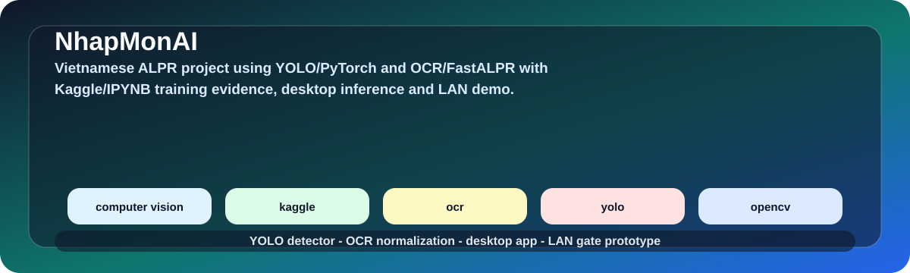
</p>

<p align="center">
  <a href="https://github.com/lhlizdabezt/NhapMonAI/releases/latest"></a>
  <a href="https://github.com/lhlizdabezt/NhapMonAI/tags"></a>
  
  
</p>

<p align="center">
  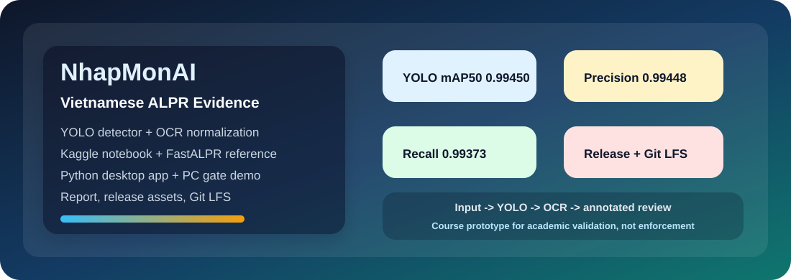
</p>

<p align="center">
  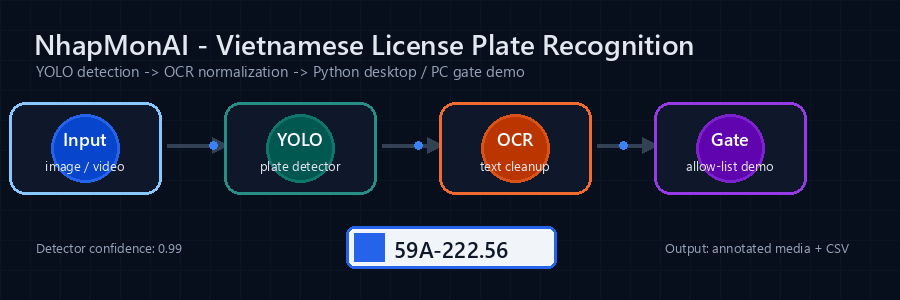
</p>

## Project Summary

`NhapMonAI` is a Group 05 course project for Vietnamese automatic license plate recognition. It combines a YOLO plate detector, OCR processing with FastALPR and fast-plate-ocr concepts, a Python desktop application, and a LAN-based PlateGate demonstration. The repository preserves the notebooks, checkpoints, source code, reports, presentation, screenshots, and versioned release assets used to review the work.

| Field | Details |
|---|---|
| Course | Introduction to Artificial Intelligence |
| Faculty | Faculty of Electronics and Telecommunications, VNUHCM - University of Science |
| Class context | `22DTV_CLC1`, Group 05 |
| Status | Completed academic prototype and public portfolio archive |
| Main stack | Python, PyTorch, Ultralytics YOLO, OpenCV, FastALPR, fast-plate-ocr, FFmpeg, Tkinter, Jupyter Notebook, Kaggle, Typst |
| Maintainer | [Luong Hai Long](https://github.com/lhlizdabezt), Student ID `22207056` |
| Stable package | [Latest GitHub release](https://github.com/lhlizdabezt/NhapMonAI/releases/latest) |

## Scope and Contribution

This is a seven-member academic project. Luong Hai Long co-developed the Python desktop application and PlateGate PC demonstration, maintained the Kaggle training evidence, and prepared the public repository, release package, and visual documentation. The repository does not assign unverified individual contributions to other members.

The system is an academic prototype, not a production traffic-enforcement product. Reported metrics apply to the project validation set; they do not establish OCR accuracy or operational reliability under every camera, plate, weather, or lighting condition.

## System Pipeline

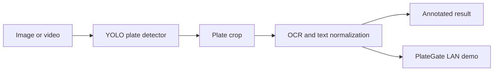
```mermaid
flowchart LR
  A[Image or video] --> B[YOLO plate detector]
  B --> C[Plate crop]
  C --> D[OCR and text normalization]
  D --> E[Annotated result]
  D --> F[PlateGate LAN demo]
```

| Stage | Engineering Function |
|---|---|
| Detection | Locates candidate license plates and returns bounding boxes |
| Cropping | Extracts plate regions for OCR processing |
| Recognition | Reads candidate text and applies project normalization rules |
| Desktop output | Displays and saves annotated image or video results |
| Gate demonstration | Sends a plate string to a local allow-list workflow over HTTP |

## Quantitative Results

The continuation-training checkpoint reports the following detector results on the project validation set:

| Metric | Result |
|---|---:|
| Precision | `0.99448` |
| Recall | `0.99373` |
| mAP50 | `0.99450` |
| mAP50-95 | `0.77006` |

The detector metrics are not OCR metrics. Review the notebook outputs, confusion matrices, and report discussion before comparing these values with another dataset or deployment.

## Visual Evidence

| Python Desktop Application | Video Inference Output |
|---|---|
| 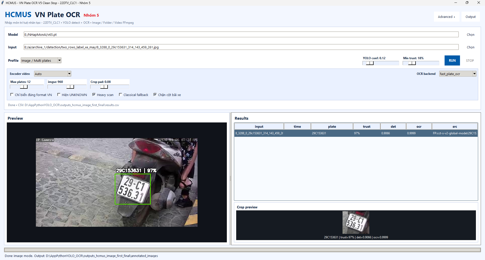 | 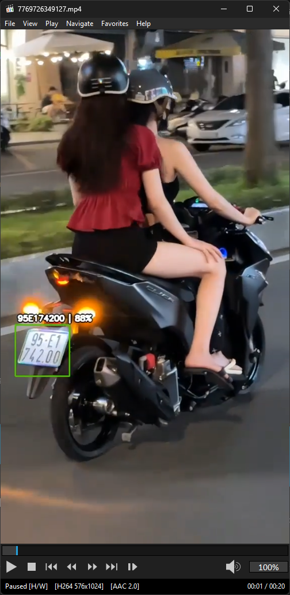 |

| Continuation-Training Curves | Detector Confusion Matrix |
|---|---|
| 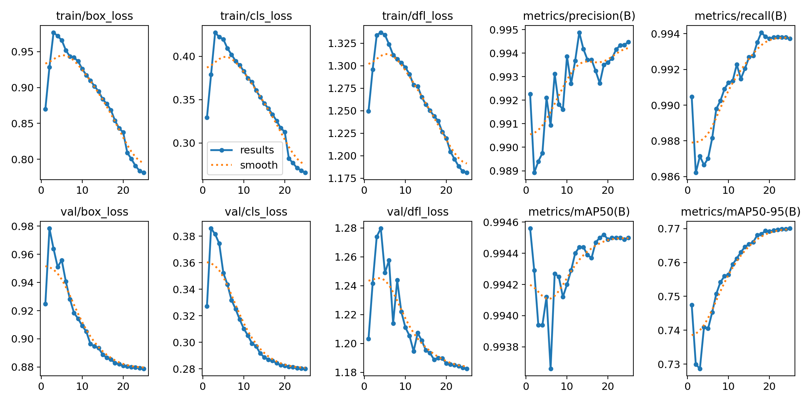 | 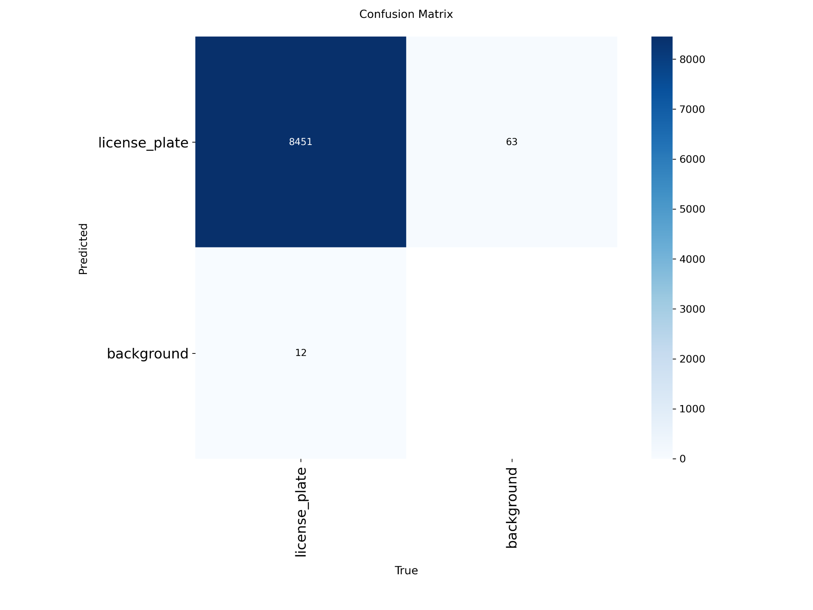 |

| OCR Demonstration | Checkpoint Continuation Evidence |
|---|---|
| 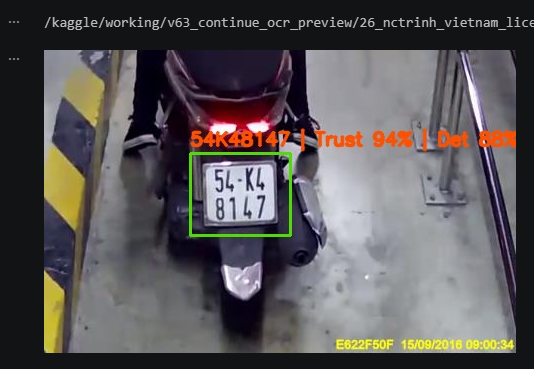 | 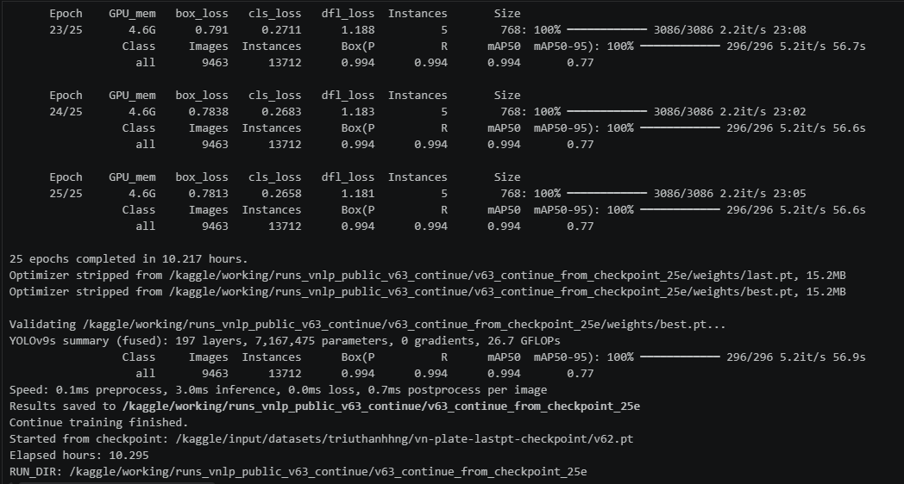 |

| Mobile Scan Demonstration | PlateGate PC Demonstration |
|---|---|
| 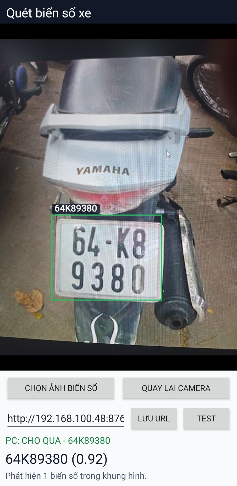 | 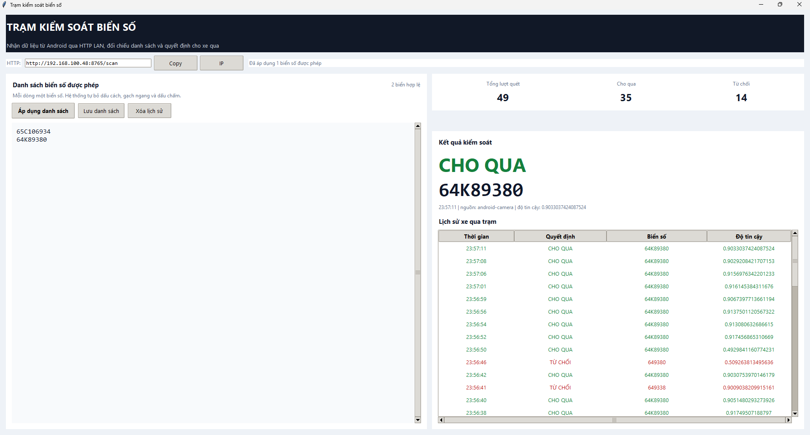 |

## Repository Guide

```text
NhapMonAI/
|-- Academic_Deliverables/             # Assignment and seminar presentation files
|-- AppPythonPlateGatePC/              # PlateGate PC LAN demonstration
|-- AppPythonYOLO_OCR/                 # Desktop app, checkpoints, FFmpeg, notebooks, and outputs
|-- assets/                            # English, line-free GitHub visuals
|-- Group5_BaoCaoNhapMonAI/            # Typst report source, bibliography, and figures
|-- Group5_Notebook_IPYNB/             # Initial and continuation-training notebooks
|-- HinhAnhBaoCao/                     # Report and presentation screenshots
|-- Group5_BaoCaoSeminarNhapMonAI.pdf  # Seminar report
|-- Typst_Guide.pdf                    # Typst reference used with the report workflow
|-- v65.pt                             # Detector checkpoint
|-- RELEASE_NOTES.md                   # Current release scope and verification record
`-- README.md
```

Large checkpoints, application archives, and FFmpeg executables are managed with Git LFS. Install Git LFS before cloning.

## Reproduce the Desktop Demonstration

### 1. Clone the complete repository

```bash
git lfs install
git clone https://github.com/lhlizdabezt/NhapMonAI.git
cd NhapMonAI
git lfs pull
```

### 2. Install the Python dependencies

```bash
cd AppPythonYOLO_OCR
python -m pip install --upgrade pip
python -m pip install -r requirements.txt
```

### 3. Start the desktop application

```bash
python Group5_AppPython_YOLO_OCR.py
```

Windows users may instead run `AppPythonYOLO_OCR/run_Group5_AppPython_YOLO_OCR.bat`.

### 4. Start the PlateGate PC demonstration

```bash
cd AppPythonPlateGatePC/PlateGatePC
python Group5_AppPYMoRongThucTe.py
```

The local demonstration exposes `GET /health` and `POST /scan` on port `8765`. Its `bien_so_duoc_phep.txt` file provides the project allow list.

```powershell
Invoke-RestMethod -Uri "http://127.0.0.1:8765/health"
Invoke-RestMethod -Uri "http://127.0.0.1:8765/scan" -Method Post -ContentType "application/json" -Body '{"plate":"59A22256","score":0.99,"source":"manual-test"}'
```

## Training Evidence and References

| Resource | Purpose |
|---|---|
| [`Group5_Notebook01_FirstTraining.ipynb`](Group5_Notebook_IPYNB/Group5_Notebook01_FirstTraining.ipynb) | Initial YOLO training run |
| [`Group5_Notebook02_ContinuationTraining.ipynb`](Group5_Notebook_IPYNB/Group5_Notebook02_ContinuationTraining.ipynb) | Continuation training from a checkpoint |
| [`group-5-vietnamese-license-plates-detection-lhl.ipynb`](AppPythonYOLO_OCR/group-5-vietnamese-license-plates-detection-lhl.ipynb) | Kaggle-style training and output trace |
| [Kaggle profile](https://www.kaggle.com/luonghailong/code) | Original training workspace; this repository keeps the stable notebook copy |
| [Project dataset folder](https://drive.google.com/drive/folders/1xBDnh_NdHC5JePgazb0ZRDhu6Jpbo3sT?usp=drive_link) | Group dataset storage; access depends on sharing settings |
| [FastALPR](https://github.com/ankandrew/fast-alpr) | ALPR framework reference |
| [fast-plate-ocr](https://github.com/ankandrew/fast-plate-ocr) | OCR component reference |

Paths in the notebooks reflect the original Kaggle or local environment and may require adjustment on another computer.

## Reports and Release Assets

| Artifact | Review Purpose |
|---|---|
| [Seminar report PDF](https://github.com/lhlizdabezt/NhapMonAI/releases/latest/download/Group5_BaoCaoSeminarNhapMonAI.pdf) | Project objective, method, results, and limitations |
| [Seminar slide deck](https://github.com/lhlizdabezt/NhapMonAI/releases/latest/download/Group5_SlideSeminarNhapMonAI.pptx) | Course presentation artifact |
| [Python app archive](https://github.com/lhlizdabezt/NhapMonAI/releases/latest/download/AppPythonYOLO_OCR.7z) | Desktop inference application package |
| [PlateGate PC archive](https://github.com/lhlizdabezt/NhapMonAI/releases/latest/download/AppPythonPlateGatePC.zip) | LAN demonstration package |
| [Motion GIF](https://github.com/lhlizdabezt/NhapMonAI/releases/latest/download/alpr-pipeline-motion.gif) | Line-free animated project summary |
| [Review card SVG](https://github.com/lhlizdabezt/NhapMonAI/releases/latest/download/alpr-review-card.svg) | ASCII-safe detector and evidence summary |
| [Portfolio SVG](https://github.com/lhlizdabezt/NhapMonAI/releases/latest/download/portfolio-motion.svg) | English project overview for stable embeds |
| [Source snapshot](https://github.com/lhlizdabezt/NhapMonAI/releases/latest/download/NhapMonAI-source-v1.1.2.zip) | Full tracked repository state, including Git LFS-backed project assets |

## Limitations

- Recognition quality depends on plate visibility, image resolution, viewing angle, lighting, occlusion, and plate layout.
- Dataset access and notebook paths can require permission or local path changes.
- The PlateGate component demonstrates a local LAN workflow; it is not a hardened access-control service.
- The repository has no open-source license. Treat it as a public academic portfolio archive unless a license is added later.

## Frequently Asked Questions

**Is this a production ALPR system?**

No. It is an academic detector, OCR, desktop inference, and LAN demonstration project.

**Where should a reviewer begin?**

Open the latest release, review the metric table and evidence gallery, then inspect the continuation-training notebook and seminar report.

**Why are the GitHub visuals line-free?**

The SVG and GIF assets avoid decorative connector paths so labels remain unobstructed at desktop and narrow widths.

**Are all large files included?**

Yes. The tracked repository contains the project subfolders and academic artifacts; Git LFS stores the designated large binaries and archives.

## Team

| Student ID | Name | Public Record |
|---|---|---|
| `22207043` | Mai Xuan Khang | Group 05 member |
| `22207106` | Truong Quang Vu | Group 05 member |
| `22207112` | Ly Phi Hung | Group 05 member |
| `22207063` | Van Dinh Nam | Group 05 member |
| `22207062` | Tran Si Nam | Group 05 member |
| `22207056` | [Luong Hai Long](https://github.com/lhlizdabezt) | Repository maintenance, Kaggle evidence, Python app contribution, PlateGate contribution, release packaging, and portfolio documentation |
| `22207066` | Le Tan Phi Pha | Group 05 member |

## Contact

| Channel | Link |
|---|---|
| GitHub | [github.com/lhlizdabezt](https://github.com/lhlizdabezt) |
| LinkedIn | [linkedin.com/in/lhlizdabezt](https://www.linkedin.com/in/lhlizdabezt) |
| Work email | [luonghailong.work@gmail.com](mailto:luonghailong.work@gmail.com) |
| Student email | [22207056@student.hcmus.edu.vn](mailto:22207056@student.hcmus.edu.vn) |
| Phone | [+84 988 114 708](tel:+84988114708) |
| Facebook | [facebook.com/wageseadrake](https://www.facebook.com/wageseadrake) |
| Instagram | [instagram.com/lhlizdabezt](https://www.instagram.com/lhlizdabezt) |
| YouTube | [youtube.com/@lhlizdabezt](https://www.youtube.com/@lhlizdabezt) |
| TikTok | [tiktok.com/@wageseadrake](https://www.tiktok.com/@wageseadrake) |
